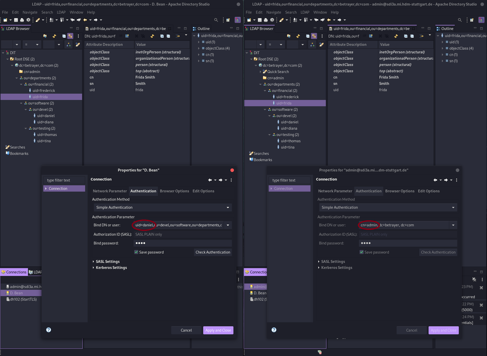
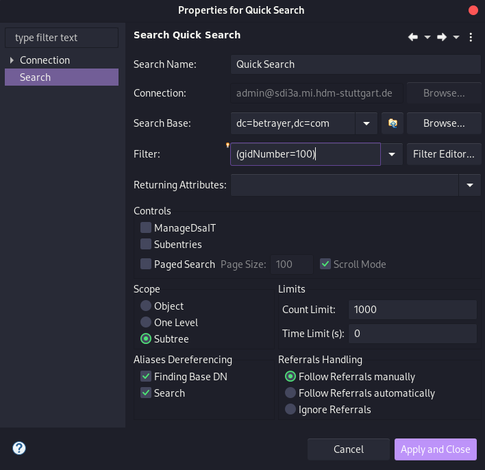
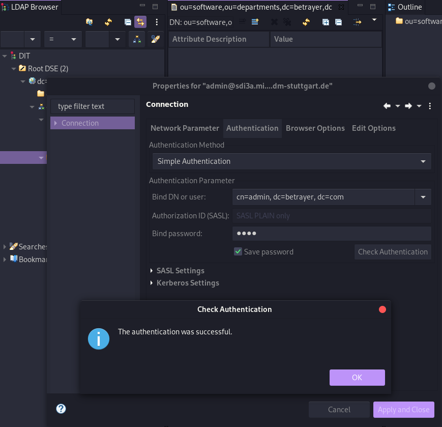
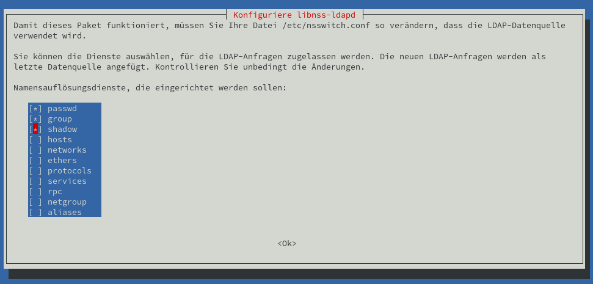

# Software Defined Infrastructure
## 1. DNS 

### 1.1 Queriyng DNS data

Due to the absence of `dig`, this was installed with the following command 
```bash
$ apt install dnsutils
```

#### 1.1.1 Queriyng www.hdm-stuttgart.de

MX:

```bash
$ dig +nocmd hdm-stuttgart.de mx +noall +answer:
  hdm-stuttgart.de.	2752	IN	MX	10 mx2.hdm-stuttgart.de.
  hdm-stuttgart.de.	2752	IN	MX	10 mx4.hdm-stuttgart.de.
  hdm-stuttgart.de.	2752	IN	MX	10 mx3.hdm-stuttgart.de.
  hdm-stuttgart.de.	2752	IN	MX	10 mx1.hdm-stuttgart.de.
```

```bash
$ dig +noall +answer 10 mx2.hdm-stuttgart.de.:
  mx2.hdm-stuttgart.de.	3197	IN	A	141.62.1.23
```

```bash
$ dig +nocmd +noall +answer -x 141.62.1.23:
  23.1.62.141.in-addr.arpa. 3142	IN	PTR	mx2.hdm-stuttgart.de.
```

NS:
```bash
$ dig +nocmd hdm-stuttgart.de ns +noall +answer:
  hdm-stuttgart.de.	3590	IN	NS	iz-net-4.hdm-stuttgart.de.
  hdm-stuttgart.de.	3590	IN	NS	iz-net-3.hdm-stuttgart.de
  hdm-stuttgart.de.	3590	IN	NS	dns1.belwue.de.
  hdm-stuttgart.de.	3590	IN	NS	iz-net-2.hdm-stuttgart.de.
  hdm-stuttgart.de.	3590	IN	NS	dns3.belwue.de.
```

```bash
$ dig +noall +answer dns1.belwue.de.:
  dns1.belwue.de.		86400	IN	A	129.143.2.10
```

```bash
$ dig +nocmd +noall +answer -x 129.143.2.10:
  10.2.143.129.in-addr.arpa. 86400 IN	PTR	dns1.belwue.de.
```

### 1.1.2 Queriyng www.spotify.com
  
CNAME:
```bash
$ dig +noall +answer www.spotify.com:
  www.spotify.com.	230	IN	CNAME	edge-web-split-geo.dual-gslb.spotify.com.
  edge-web-split-geo.dual-gslb.spotify.com. 80 IN	A 35.186.224.25
```

```bash
$ dig +noall +answer -x 35.186.224.25:
  25.224.186.35.in-addr.arpa. 120	IN	PTR	25.224.186.35.bc.googleusercontent.com.
```


### 1.2 Installing Bind

  Über folgenden Command wurde Bind9 inklusive den Utils installiert: 
  ```bash
  apt install bind9 bind9utils
  ```

  In `/etc/bind/` we need to adjust the `named.conf.options`, for that we need the IP-adress of our domain `sdi3a.mi.hdm-stuttgart.de` we want to forward. For that we used the following command 
  ```bash
  $ dig +nocmd sdi3a.mi.hdm-stuttgart.de +noall +answer:
    sdi3a.mi.hdm-stuttgart.de. 86400 IN	A	141.62.75.103
   ```
   Now we can enter the ip-adress in the already mentioned file.

#### 1.2.1 Configure the zone file

  To create the forward zone we need to adjust the file `:named.conf.local` which should look like following: 

```bash
//
// Do any local configuration here
//

zone "mi.hdm-stuttgart.de" {

  type master;

  file "/etc/bind/zones/db.forward";

  allow-transfer { 141.62.75.103; };

  };


zone "75.62.141.in-addr.arpa" {

  type master;

  file "/etc/bind/zones/db.reverse";

  allow-transfer { 141.62.75.103; };

  };

// Consider adding the 1918 zones here, if they are not used in your
// organization
//include "/etc/bind/zones.rfc1918";
  ```
#### 1.2.2 Configure the zone file
For our zones we need to enable IPv4 in the File ```/etc/default/bind9``` with the parameter 
```
# startup options for the server
OPTIONS="-4 -u bind"
```
#### 1.2.3 Create cache directory

  ```bash 
  $ mkdir -p /var/cache/bind
  ```


#### 1.2.4 Configure the created zones

  In the first step we need to change our directory to
  ```bash 
  $ cd /etc/bind
  $ mkdir zones
  ```
##### 1.2.4.1 Configure forward zone
  We start to configure our forward lookup zone `zones/db.forward` with 
```bash 
$ vim db.forward
```

To get the host record we need to `dig` sdi3a.mi.hdm-stuttgart.de.

```bash
$ dig +noall +answer sdi3a.mi.hdm-stuttgart.de.:
  sdi3a.mi.hdm-stuttgart.de. 86400 IN	A	141.62.75.103
```
With this information we can adjust our file `zones/db.forward` which looks like the following:

```
; db.forward
; Forward lookup zone

$TTL 604800 
@                    IN            SOA           ns3.mi.hdm-stuttgart.de. kuhn.hdm-stuttgart.de. (
                         01; 
                         28800;
                         7200;
                         2419200;
                         86400;
 )

                                               NS                  ns3
ns3                              IN            A                   141.62.75.103
sdi3a                            IN            A                   141.62.75.103
sdidoc.sdi3a                     IN            A                   141.62.75.103
www                              IN            A                   141.62.75.103
manual.sdi3a                     IN            A                   141.62.75.103
www3-1                           IN            CNAME               www
www3-2                           IN            CNAME               www
info                             IN            CNAME               www
```

##### 1.2.3.2 Configure reverse zone

With the information we became above from the dig command, we can configure our reverse zone:

```
; db.rev-local
; reverse lookup zone

$TTL 604800 
@                    IN            SOA            ns3.mi.hdm-stuttgart.de. kuhn.hdm-stuttgart.de. (
                         01; 
                         28800;
                         7200;
                         2419200;
                         86400;
 )
                                   NS            ns3.
103                  IN            PTR           sdi3a.mi.hdm-stuttgart.de.
```

##### 1.2.4 Forwarders

We use the CloudFlare DNS service, as a forwarder.

Now we can add the forwarder in the file `/etc/bind/named.conf.options`:
```
forwarders {
	1.1.1.1
};
```

##### 1.2.5 Set mail exchange record

For this we need to set another record in our forward zone `etc/bind/zones/db.forward`:
```
mail                             IN            MX          10      mx1.hdm-stuttgart.de.
```

Test the record via `nslookup`:
```bash
$ nslookup manual.sdi3a.mi.hdm-stuttgart.de 141.62.75.103
Server:		141.62.75.103
Address:	141.62.75.103#53

Name:	manual.sdi3a.mi.hdm-stuttgart.de
Address: 141.62.75.103
```

```bash
$ nslookup -type=ptr 141.62.75.103
Server:		127.0.0.53
Address:	127.0.0.53#53

Non-authoritative answer:
103.75.62.141.in-addr.arpa	name = sdi3a.medieninformatik.hdm-stuttgart.de.

Authoritative answers can be found from:
```

## Bibliography


## 2. LDAP 

### 2.1 Recommended Preparations

#### What is the LDAP Protocol? What is the difference between the two protocols ldap and ldaps?
```
"The Lightweight Directory Access Protocol can be used for queriyng and modifying information from distributed directory services." 

The difference between these two protocols are the encrytpion, LDAPS is encrypted via SSL and running on the default port 636, LDAP is encrypted via STARTTLS or decrypted and running on default port 389.
("Editorial - LDAP", 2021)
```

#### What does the acronym dc in dc=somedomain, dc=org stand for?
```
It stands for domain component and represents the namespaces of an object (Willeke, 2019).
```

#### What is the role of LDAP objectclass definitions? How do they relate to LDAP schema definitions?
```
The ObjectClass is a LDAP Schema element AttributeType (Willeke, 2019).
```

#### Describe the relationship between LDAP entries and objectClass values.
```
Each LDAP Entry in the Directory Information Tree has an ObjectClass attribute. The Values of this attribute can be modified but not removed (Willeke, 2019).
```

#### Is it possible to dynamically change an entries structure?
```
No, the structure must conforms the constraint defined by the LDAP Schema (Willeke, 2019).
```

#### What does the term “bind to an LDAP” server mean? What is an “anonymous” bind?
```
Bind is used to authenticate clients to the directory server.

There are three elements include in the request:
1. LDAP protocol version
2. Distinguished Name (DN)
3. Credentials for user authentication

At an anonymous bind the above points 2. and 3. are submitted as an empty string.

(Wilson, -)
```

#### Do LDAP servers in general support database features like transactions, ACID semantic etc.?
```
"Lightweight Directory Access Protocol (LDAP) Transactions is define din RFC 5805 and is defined as "Experimental".

As with distinct update operations, each transaction has atomic, consistency, isolation, and durability properties ACID."
(Willeke, 2017)
```

#### Explain the term “replication” in an LDAP server context.
```
For distribution reasons the LDAP-database can be distributed to several servers. There exists one master, on which write-operations are allowed, at the others can only pull the changes from the master (Anonym, 2019).
```

#### Why do organizations sometimes prefer LDAP data repositories rather than using relational database systems?
```
LDAP is very suitable in cases of high read rates and low write rates (write-once-read-many-times). 
Furthermore relational databases like SQL requieres a detailed knowledge about the data structure, which isnt the case when it comes to LDAP.
(ZyTrax, 2019)
```


#### How is the LDIF format being organized? Explain the practical use of LDIF data when running a LDAP service.
```
The format is organized with abjects and attributes. The LDIF datas describes the directory structure which is needed for exchange 
("Editorial - LDIF", 2021)
```

#### LDAP filters

##### How do LDAP filters work?
```
There are several filters in LDAP, with these filters its possible to add criterias to an object search.
(Föckeler, -)
```

##### What is the meaning of the term scope?
```
The LDAP search scope indicates the set of entries at or below the BaseDN that may be considered potential matches for a SearchRequest (Willeke, 2019).
```

##### How do predicate based filters connected by logical and/or/not look like?
```
And:  (& (...K1...) (...K2...) (...K3...) (...K4...))
Or:   (| (...K1...) (...K2...) (...K3...) (...K4...)) 
Not:  (! (...K1...) (...K2...) (...K3...) (...K4...))
```

#### OpenLDAP server software specific questions

##### What does the term “database backend” refer to with respect to OpenLDAP server implementation?
```
Backends do the actual work of storing or retrieving data in response to LDAP requests. Backends may be compiled statically into slapd, or when module support is enabled, they may be dynamically loaded (Open LDAP Foundation, 2021). 
```

##### Why is LDAP replication important?
```
The risk of a failure will be minimized and the traffic load will be reduced.
```
##### How do you restrict access to LDAP directories?
<!-- TODO finish questions. -->


## Bibliography
Willeke, J. (various dates). LDAP Wiki 3. May 2021, from https://ldapwiki.com/wiki

Editorial - LDAP. (2021, April 19). In Wikipedia. https://de.wikipedia.org/wiki/Lightweight_Directory_Access_Protocol

Editorial - LDIF. (2021, April 19). In Wikipedia. https://de.wikipedia.org/wiki/LDAP_Data_Interchange_Format

Bosswell, W. (2003, October 10). ObjectClasses queried 3. May 2021, from https://www.informit.com/articles/article.aspx?p=101405&seqNum=7#:~:text=Domain%20Component%20(DC).,%3DCompany%2Cdc%3Dcom.

Wilson, N. (No datum availabel). The LDAP Bind Operation queried 3. May 2021, from https://ldap.com/the-ldap-bind-operation/

Anonym (2019, September 3). LDAP Wiki 3. May 2021, from https://ldapwiki.com/wiki

ZyTrax Inc. (2019, February 19). LDAP Concepts & Overview 7. May 2021, from http://www.zytrax.com/books/ldap/ch2/

Föckeler, P. (No datum availabel). Das LDAP Scripting Tutorial queried 10. May 2021, from http://www.selfadsi.de/ldap-filter.htm

Open LDAP Foundation. (2021, February 26). OpenLDAP queried 10. May 2021, from https://www.openldap.org/doc/admin25/


### 2.2 Exercises

#### 2.2.1 Browse an existing LDAP Server

##### 2.2.1.1 No Authentication vs. Authentication?
When you are authenticated on the LDPA-server, you can see all datas which belongs to your user. When you are not authenticated you can also see all datas with the exception of the ```matrikelNr```.


#### 2.2.2 Set up an OpenLdap server
First we need to install several packages on our server:
```bash
$ apt install slapd ldap-utils dialog
```
To reconfigure ```slapd``` we need to type ```$ dpkg-reconfigure slapd```.

#### 2.2.3 Populating your DIT
After add all entrys in our tree, it look like the following:
```
version: 1

dn: dc=betrayer,dc=com
objectClass: dcObject
objectClass: organization
objectClass: top
dc: betrayer
o: betrayer.com

dn: cn=admin,dc=betrayer,dc=com
objectClass: organizationalRole
objectClass: simpleSecurityObject
cn: admin
userPassword:: e1NTSEF9UUpzZm96RVFxVTFadEhGN3VrWE96dDNZRi9hc09LaXY=
description: LDAP administrator

dn: ou=departments,dc=betrayer,dc=com
objectClass: organizationalUnit
objectClass: top
ou: departments

dn: ou=software,ou=departments,dc=betrayer,dc=com
objectClass: organizationalUnit
objectClass: top
ou: software

dn: ou=financial,ou=departments,dc=betrayer,dc=com
objectClass: organizationalUnit
objectClass: top
ou: financial

dn: ou=devel,ou=software,ou=departments,dc=betrayer,dc=com
objectClass: organizationalUnit
objectClass: top
ou: devel

dn: ou=testing,ou=software,ou=departments,dc=betrayer,dc=com
objectClass: organizationalUnit
objectClass: top
ou: testing

dn: uid=diana,ou=devel,ou=software,ou=departments,dc=betrayer,dc=com
objectClass: inetOrgPerson
objectClass: organizationalPerson
objectClass: person
objectClass: top
cn: Diana Smith
sn: Smith
uid: diana

dn: uid=daniel,ou=devel,ou=software,ou=departments,dc=betrayer,dc=com
objectClass: inetOrgPerson
objectClass: organizationalPerson
objectClass: person
objectClass: top
cn: Daniel Bean
sn: Bean
uid: daniel
userPassword:: e1NNRDV9QlRqWVBrL2tuSjkrUGNIRk1SeUhBWXdCOHFLeGVMQ2I=

dn: uid=tina,ou=testing,ou=software,ou=departments,dc=betrayer,dc=com
objectClass: inetOrgPerson
objectClass: organizationalPerson
objectClass: person
objectClass: top
cn: Tina Bean
sn: Bean
uid: tina

dn: uid=thomas,ou=testing,ou=software,ou=departments,dc=betrayer,dc=com
objectClass: inetOrgPerson
objectClass: organizationalPerson
objectClass: person
objectClass: top
cn: Thomas Smith
sn: Smith
uid: thomas

dn: uid=frida,ou=financial,ou=departments,dc=betrayer,dc=com
objectClass: inetOrgPerson
objectClass: organizationalPerson
objectClass: person
objectClass: top
cn: Frida Smith
sn: Smith
uid: frida

dn: uid=frederick,ou=financial,ou=departments,dc=betrayer,dc=com
objectClass: inetOrgPerson
objectClass: organizationalPerson
objectClass: person
objectClass: top
cn: Frederick Bean
sn: Bean
uid: frederick
```

#### 2.2.4 Testing a bind operation as non - admin user


#### 2.2.5 Filter based search

All users with a ```uid``` attribute value starting with the letter “b”:
```
(uid=b*)
```

All entries with either a defined ```uid``` attribute or a ```ou``` attribute starting with letter “d”:
```
(|(uid=d*)(ou=d*))
```

All users entries within the whole DIT having a gidNumber value of 100:


All users entries within the whole DIT having a gidNumber value greater then 1023:


All users entries within the whole DIT having the substring "ei" in their cn attribute:


All users entries within the whole DIT having starting with the character "t" in their uid attribute or the gidNumber is equal to 100:


#### 2.2.6 Extending an existing entry
The entry uid=bean,ou=devel,ou=software,ou=departments,dc=betrayer;dc=com may be extended by the objectclass posixAccount. Construct a LDIF file to add the attributes uidNumber, gidNumber and homeDirectory by a modify/add operation.

```
uid=bean, ou=devel, ou=software, ou=departments, dc=betrayer, dc=com
changetype: add
objectClass: posixAccount
uidNumber: 42
gidNumber: 1337
homeDirectory: /
```

#### 2.2.7 Accessing LDAP data by a mail client


#### 2.2.8 LDAP configuration


#### 2.2.9 LDAP based user login
##### 2.2.9.1 Test connection to active directory
```
$ root@sdi3b:~# telnet sdi3a.mi.hdm-stuttgart.de 389
```
```
Trying 141.62.75.103...
Connected to sdi3a.mi.hdm-stuttgart.de.
Escape character is '^]'.
```

##### 2.2.9.2 Install and configure libpam-ldapd
```
$ apt-get install libpam-ldapd
```
After the installation a window will open, where we can configure the package.

In the following window we need to enter the hostname to our arctive directories.


After that we need to enter the distinguished name.




After the configuration the installation of the package will be finished and we need to reboot the VM.

After that we can run request
```
$ id daniel
uid=42(daniel) gid=1337 Gruppen=1337
```

In the last step we need to create a user and a group accordingly, which we need to assign to the user:
```bash
$ groupadd -g 1337 betrayer_software_devel
$ useradd -u 42 daniel
$ usermod -g betrayer_software_devel daniel
$ mkhomedir_helper daniel
```


#### 2.2.10 Backup and recovery / restore

Create a backup of the OpenLDAP database configuration to an LDIF file. 
```bash
$ slapcat -b cn=config -l ldap-config.ldif
```

Create a backup of the OpenLDAP data. 
```bash 
$ slapcat -l ldap-data.ldif
```

Copy the data and configuration backup from the OpenLDAP provider server to the OpenLDAP consumer server. 
```bash 
$ scp {ldap-data.ldif,ldap-config.ldif} root@sdi3b.mi.hdm-stuttgart.de:
```

Now we need to access our consumer server via ssh.
```bash
$ ssh root@sdi3b.mi.hdm-stuttgart.de
```

Restore the OpenLDAP provider Data and configs on the consumer server.
Stop the LDAP service.
```bash 
$ systemctl stop slapd
```

Ensure that the LDAP configuration and data directories are empty.
```bash 
$ rm -rf /etc/ldap/slapd.d/* 
$ rm -rf /var/lib/ldap/*
```

Restore the configuration backup. 
```bash
$ slapadd -b cn=config -l /root/ldap-config.ldif -F /etc/ldap/slapd.d/
```

Restore the LDAP data directories. 
```bash
$ slapadd -n 1 -l /root/ldap-data.ldif -F /etc/ldap/slapd.d/
```

#### 2.2.11 Accessing LDAP by a Pyhton application.
https://www.python-ldap.org/en/python-ldap-3.3.0/
https://github.com/python-ldap/python-ldap

## 3. Apache Web Server

### 3.1 Exercises
For the following tasks we need the package ```apache2```, which we can install with the following command:
```bash
$ aptitude install apache2
```

### 3.1.1 First Steps
   
1. After we install the package apache is running per default and can in our case be queried with ```http://sdi3a.mi.hdm-stuttgart.de/```.

2. When we move the index.html file out of the directory we can discover another page, when we query the adress again. 
Now we can se an empty table and below that we find the version of our Apache Server, the domain where its hosted and the associated port.

3. In the next step we povide our own simple webpage which looks like the following:
  ```html
  <!DOCTYPE html>
  <html>
    <body>
      <h1>TEST</h1>
    </body>
  </html>
  ```

  4. In the next step we install the apache2 documentation with the following command:
   ``` bash
   $ apt install apache2-doc
   ```
   In our case we can find all related files from the packe ```apache2-doc```:
   ```bash
   $ dpkg -L apache2-doc
   ```
   The result is a huge list of file which all belongs to the following path: ```/usr/share/doc/apache2-doc/manual/```

  5. In the last task we want to host our documentation on our web server. But first we need to convert our .md to valid .html, which can be done with the pandoc package:
   ```bash
  $ pandoc -s -o index.html Software\ Defined\ Infrastructure.md
  ``` 

  We want to store the index.html later in ```home/sdidoc``` so we need to create this directroy:
  ```bash
  $ cd /home
  $ mkdir sdidoc
  ```

  After that we can transfer our file from the local machine to our hdm vm:
  ```bash
  $ scp index.html root@sdi3a.mi.hdm-stuttgart.de:/home/sdidoc/
  ```

Now we need to adjust our config file in ```/etc/apache2/sites-available/000-default.conf``` with the following terms:
```
<Directory /home/sdidoc>
  Options Indexes FollowSymLinks Includes ExecCGI
  AllowOverride All
  Require all granted
  Allow from all
</Directory>
```

To make our change effective we need to restart the apache web service:
```
$ systemctl reload apache2
```

### 3.1.2 Virtual hosts
To realize virtual hosts we need to create a .con file in ```/etc/apache2/sites-available```, the config in this file should look like the following:
   ```
  <VirtualHost *:80>
      ServerAdmin dh102@hdm-stuttgart.de
      ServerName sdi3a.mi.hdm-stuttgart.de
      ServerAlias dh102.sdi3a.mi.hdm-stuttgart.de
      DocumentRoot /home/sdidoc/
      ErrorLog ${APACHE_LOG_DIR}/error.log
      CustomLog ${APACHE_LOG_DIR}/access.log combined
  </VirtualHost>
   ```
Now the side must be enabled with ```$ a2ensite dh102.conf``` and add the follwing code to ```/etc/apache2/apache2.conf```:   
```
<Directory /home/sdidoc/>
        AllowOverride None
        Require all granted
        Options Indexes FollowSymLinks
</Directory>
```

Now it is important to grant apache2 the access to the directory where our ```index.html``` is placed:
```$ chown -R www-data /home/sdidoc```

To access the webpage from a local machine, we need to give our local machine the relevant information to reach the page.
This can be done by enter the information on our local machine with ```$ sudo vim /etc/hosts```:
```
141.62.75.103 sdi3a.mi.hdm-stuttgart.de dh102.sdi3a.mi.hdm-stuttgart.de
```

To setup the ```manual.sdi3a.mi.hdm-stuttgart.de``` we can copy our first .conf file, enable it and register the information on localhost.

### 3.1.3 SSL / TLS Support
The first step ist that we need to create our private root key whith a bit length of 2048:
```
$ openssl genrsa -out rootCA.key 2048
```

For security reasons we should encrypt our key
```
$ openssl genrsa -des3 -out rootCA.key 2048
```

With our ```rootCA.key``` we can now self-sign a certificate
```
$ openssl req -x509 -new -nodes -key rootCA.key -sha256 -days 1024 -out rootCA.pem
```

The above command starts an interactive script, which in our case looked like the following after processing:
```
You are about to be asked to enter information that will be incorporated
into your certificate request.
What you are about to enter is what is called a Distinguished Name or a DN.
There are quite a few fields but you can leave some blank
For some fields there will be a default value,
If you enter '.', the field will be left blank.
-----
Country Name (2 letter code) [AU]:DE
State or Province Name (full name) [Some-State]:Baden-Württemberg
Locality Name (eg, city) []:Portland
Organization Name (eg, company) [Internet Widgits Pty Ltd]:Hochschule der Medien
Organizational Unit Name (eg, section) []:MI-Member
Common Name (eg, YOUR name) []:dh102
Email Address []:dh102@hdm-stuttgart.de
```

To access our created certificate we can transfer the file via scp from the server to our local machine:
```
$ scp root@sdi3a.mi.hdm-stuttgart.de:/root/ssl-cert/rootCA.pem /home/user/certificates/
```
Now we can import the CA certificate into our Firefox browser.

In the next step we need to create a certificate for our webpage (device). We starting again with the key:
```bash
$ openssl genrsa -out device.key 2048
```

Now we can create our device certificate:

```bash
$ openssl req -new -key device.key -out device.csr
```

The interactive script starts again and we go through it preatty much the same as before, but we need to ensure that the commone name match the ip-adress from the machine.

```
Common Name (eg, YOUR name) []: 141.62.75.103
```

So that we have our CA and the device certificate we are able to sign it:
```bash
openssl x509 -req -in device.csr -CA rootCA.pem -CAkey rootCA.key -CAcreateserial -out device.crt -days 500 -sha256
```

Now we need to sign our certificate:
```
$ openssl req -x509 -new -nodes -key rootCA.key -sha256 -days 1024 -out rootCA.pem
```

Enabling the apache SSL module:
```
$ a2enmod ssl
```

In the last step we need to adjust our configuration from the previous task ```/etc/apache2/sites-available/manual.conf```:
```
<VirtualHost *:443>
    ServerAdmin dh102@hdm-stuttgart.de
    ServerName sdi3a.mi.hdm-stuttgart.de
    ServerAlias manual.sdi3a.mi.hdm-stuttgart.de
    DocumentRoot /home/sdidoc/
    SSLEngine on
    SSLCertificateFile "/root/ssl-cert/device.crt"
    SSLCertificateKeyFile "/root/ssl-cert/device.key"
    ErrorLog ${APACHE_LOG_DIR}/error.log
    CustomLog ${APACHE_LOG_DIR}/access.log combined
</VirtualHost>
```
To make the change effective we need to restart the service:
```
systemctl restart apache2.service
```

### 3.1.3 LDAP authentication

For this exercises we use our user "daniel" from 2.2.9 LDAP based user login.

To use LDAP with Apache Web Server, we need to enable it:
```bash
$ a2enmod ldap
```


<!-- TODO FileCloud letztes Thema! -->