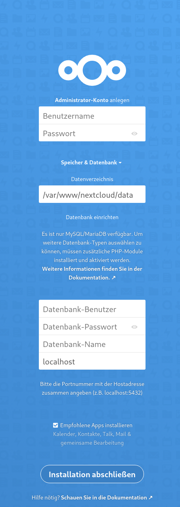
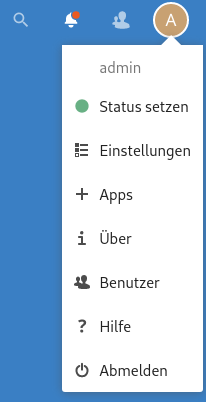
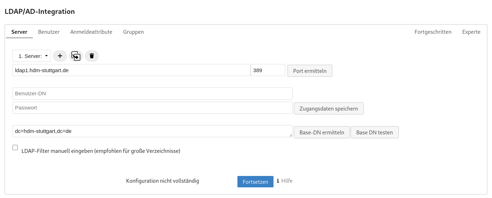
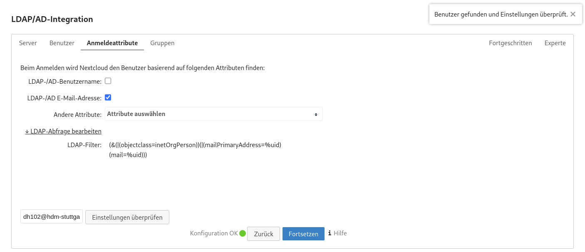

% Software Defined Infrastructure
% Daniel Hiller & Micha Huhn
% \today
\tableofcontents
\newpage

# Software Defined Infrastructure

## Introduction

### Contributing

**Found an error or have a suggestion?** Please open an issue on GitHub ([github.com/dentremor/Software-Defined-Infrastrucure](https://github.com/dentremor/Software-Defined-Infrastrucure)):

{ width=150px }

### License

{ width=128px }

Uni BWL Notes (c) 2021 Daniel Hiller and contributors

SPDX-License-Identifier: AGPL-3.0
\newpage

## DNS

### Querying DNS data

Due to the absence of `dig`, this was installed with the following command:

```bash
$ apt install dnsutils
```

#### Querying www.hdm-stuttgart.de

MX:

```bash
$ dig +nocmd hdm-stuttgart.de mx +noall +answer:
  hdm-stuttgart.de.	2752	IN	MX	10 mx2.hdm-stuttgart.de.
  hdm-stuttgart.de.	2752	IN	MX	10 mx4.hdm-stuttgart.de.
  hdm-stuttgart.de.	2752	IN	MX	10 mx3.hdm-stuttgart.de.
  hdm-stuttgart.de.	2752	IN	MX	10 mx1.hdm-stuttgart.de.
```

```bash
$ dig +noall +answer 10 mx2.hdm-stuttgart.de.:
  mx2.hdm-stuttgart.de.	3197	IN	A	141.62.1.23
```

```bash
$ dig +nocmd +noall +answer -x 141.62.1.23:
  23.1.62.141.in-addr.arpa. 3142	IN	PTR	mx2.hdm-stuttgart.de.
```

NS:

```bash
$ dig +nocmd hdm-stuttgart.de ns +noall +answer:
  hdm-stuttgart.de.	3590	IN	NS	iz-net-4.hdm-stuttgart.de.
  hdm-stuttgart.de.	3590	IN	NS	iz-net-3.hdm-stuttgart.de
  hdm-stuttgart.de.	3590	IN	NS	dns1.belwue.de.
  hdm-stuttgart.de.	3590	IN	NS	iz-net-2.hdm-stuttgart.de.
  hdm-stuttgart.de.	3590	IN	NS	dns3.belwue.de.
```

```bash
$ dig +noall +answer dns1.belwue.de.:
  dns1.belwue.de.		86400	IN	A	129.143.2.10
```

```bash
$ dig +nocmd +noall +answer -x 129.143.2.10:
  10.2.143.129.in-addr.arpa. 86400 IN	PTR	dns1.belwue.de.
```

### Querying www.spotify.com

CNAME:

```bash
$ dig +noall +answer www.spotify.com:
  www.spotify.com.	230	IN	CNAME	edge-web-split-geo.dual-gslb.spotify.com.
  edge-web-split-geo.dual-gslb.spotify.com. 80 IN	A 35.186.224.25
```

```bash
$ dig +noall +answer -x 35.186.224.25:
  25.224.186.35.in-addr.arpa. 120	IN	PTR	25.224.186.35.bc.googleusercontent.com.
```

### Installing Bind

With the following command we can install `bind9` and `bind9utils`:

```bash
$ apt install bind9 bind9utils
```

In `/etc/bind/` we need to adjust the `named.conf.options`, for that we need to know the IP-address of our domain `sdi3a.mi.hdm-stuttgart.de` to which we want to forward. For that we can use the following command:

```bash
$ dig +nocmd sdi3a.mi.hdm-stuttgart.de +noall +answer:
  sdi3a.mi.hdm-stuttgart.de. 86400 IN	A	141.62.75.103
```

Now we can enter the IP-address in the already mentioned file.

#### Configure the zone file

To register our zones (which we will create later) we need to adjust the file `:named.conf.local` which should look like the following:

```conf
//
// Do any local configuration here
//

zone "mi.hdm-stuttgart.de" {

  type master;

  file "/etc/bind/zones/db.forward";

  allow-transfer { 141.62.75.103; };

  };


zone "75.62.141.in-addr.arpa" {

  type master;

  file "/etc/bind/zones/db.reverse";

  allow-transfer { 141.62.75.103; };

  };

// Consider adding the 1918 zones here, if they are not used in your
// organization
//include "/etc/bind/zones.rfc1918";
```

For our zones we need to enable IPv4 in the file `/etc/default/bind9` with the parameter:

```conf
# startup options for the server
OPTIONS="-4 -u bind"
```

#### Create cache directory

```bash
$ mkdir -p /var/cache/bind
```

#### Configure the created zones

In the first step we need to change our directory to

```bash
$ cd /etc/bind
$ mkdir zones
```

#### Configure forward zone

We start to configure our forward lookup zone `zones/db.forward` with

```bash
$ vim db.forward
```

To get the host record we need to `dig` sdi3a.mi.hdm-stuttgart.de.

```bash
$ dig +noall +answer sdi3a.mi.hdm-stuttgart.de.:
  sdi3a.mi.hdm-stuttgart.de. 86400 IN	A	141.62.75.103
```

With this information we can adjust our file `zones/db.forward` which looks like the following:

```conf
; db.forward
; Forward lookup zone

$TTL 604800
@                    IN            SOA           ns3.mi.hdm-stuttgart.de. kuhn.hdm-stuttgart.de. (
                         01;
                         28800;
                         7200;
                         2419200;
                         86400;
 )

                                               NS                  ns3
ns3                              IN            A                   141.62.75.103
sdidoc.sdi3a                     IN            A                   141.62.75.103
sdi3a                            IN            A                   141.62.75.103
www                              IN            A                   141.62.75.103
manual.sdi3a                     IN            A                   141.62.75.103
www3-1                           IN            CNAME               www
www3-2                           IN            CNAME               www
info                             IN            CNAME               www
```

#### Configure reverse zone

With the information we got from above through the `dig` command, we can configure our reverse zone:

```conf
; db.rev-local
; reverse lookup zone

$TTL 604800
@                    IN            SOA            ns3.mi.hdm-stuttgart.de. kuhn.hdm-stuttgart.de. (
                         01;
                         28800;
                         7200;
                         2419200;
                         86400;
 )
                                   NS            ns3.
103                  IN            PTR           sdi3a.mi.hdm-stuttgart.de.
```

#### Forwarders

We use the Cloudflare DNS service as a forwarder.

Add the forwarder in the file `/etc/bind/named.conf.options`:

```conf
forwarders {
	1.1.1.1
};
```

#### Set mail exchange record

To achieve this we need to set another record in our forward zone `etc/bind/zones/db.forward`:

```conf
mail                             IN            MX          10      mx1.hdm-stuttgart.de.
```

Test the record via `nslookup`:

```bash
$ nslookup manual.sdi3a.mi.hdm-stuttgart.de 141.62.75.103
Server:		141.62.75.103
Address:	141.62.75.103#53

Name:	manual.sdi3a.mi.hdm-stuttgart.de
Address: 141.62.75.103
```

```bash
$ nslookup -type=ptr 141.62.75.103
Server:		127.0.0.53
Address:	127.0.0.53#53

103.75.62.141.in-addr.arpa	name = sdi3a.mi.hdm-stuttgart.de.
103.75.62.141.in-addr.arpa	name = dh102.sdi3a.mi.hdm-stuttgart.de.
103.75.62.141.in-addr.arpa	name = manual.sdi3a.mi.hdm-stuttgart.de.
```

## Bibliography

## LDAP

### Recommended Preparations

#### What is the LDAP Protocol? What is the difference between the two protocols LDAP and LDAPS?

"The Lightweight Directory Access Protocol can be used for querying and modifying information from distributed directory services."

The difference between these two protocols are the encryption. LDAPS is encrypted via SSL and running on the default port 636, LDAP is encrypted or decrypted via START TLS and running on the default port 389.
("Editorial - LDAP", 2021)

#### What does the acronym dc in dc=somedomain, dc=org stand for?

It stands for domain component and represents the namespaces of an object (Willeke, 2019).

#### What is the role of LDAP ObjectClass definitions? How do they relate to LDAP schema definitions?

The ObjectClass is a LDAP Schema element AttributeType (Willeke, 2019).

#### Describe the relationship between LDAP entries and ObjectClass values.

Each LDAP entry in the Directory Information Tree has an ObjectClass attribute. The values of this attribute can be modified but not removed (Willeke, 2019).

#### Is it possible to dynamically change an entrie's structure?

No, the structure must conforms the constraint defined by the LDAP Schema (Willeke, 2019).

#### What does the term “bind to an LDAP” server mean? What is an “anonymous” bind?

Bind is used to authenticate clients to the directory server.

There are three elements included in the request:

1. LDAP protocol version
2. Distinguished Name (DN)
3. Credentials for user authentication

At an anonymous bind the above points 2. and 3. are submitted as an empty string.

(Wilson)

#### Do LDAP servers in general support database features like transactions, ACID semantic etc.?

"Lightweight Directory Access Protocol (LDAP) Transactions is defined in RFC 5805 and is defined as "Experimental".

As with distinct update operations, each transaction has atomic, consistency, isolation, and durability properties ACID."
(Willeke, 2017)

#### Explain the term “replication” in an LDAP server context.

For distribution reasons the LDAP-database can be distributed to several servers. There exists one master on which write-operations are allowed. On the others you can only pull the changes from the master (Anonym, 2019).

#### Why do organizations sometimes prefer LDAP data repositories rather than using relational database systems?

LDAP is very suitable in cases of high read rates and low write rates (write-once-read-many-times).
Furthermore, relational databases like SQL requires a detailed knowledge about the data structure, which isn't the case when it comes to LDAP.
(ZyTrax, 2019)

#### How is the LDIF format being organized? Explain the practical use of LDIF data when running an LDAP service.

The format is organized with objects and attributes. The LDIF data describes the directory structure which is needed for exchange
("Editorial - LDIF", 2021)

#### LDAP filters

##### How do LDAP filters work?

There are several filters in LDAP with which it is possible to add criteria to an object search.
(Föckeler)

##### What is the meaning of the term scope?

The LDAP search scope indicates the set of entries at or below the BaseDN that may be considered potential matches for a SearchRequest (Willeke, 2019).

##### How do predicate based filters connected by logical and/or/not look like?

And: (& (...K1...) (...K2...) (...K3...) (...K4...))
Or: (| (...K1...) (...K2...) (...K3...) (...K4...))
Not: (! (...K1...) (...K2...) (...K3...) (...K4...))

#### OpenLDAP server software specific questions

##### What does the term “database backend” refer to with respect to OpenLDAP server implementation?

Backend does the actual work of storing or retrieving data in response to LDAP requests. Backend may be compiled statically into `slapd`, or when module support is enabled, they may be dynamically loaded (Open LDAP Foundation, 2021).

##### Why is LDAP replication important?

The risk of a failure will be minimized, and the traffic load will be reduced.

#### Bibliography

Willeke, J. (various dates). LDAP Wiki 3. May 2021, from https://ldapwiki.com/wiki

Editorial - LDAP. (2021, April 19). In Wikipedia. https://de.wikipedia.org/wiki/Lightweight_Directory_Access_Protocol

Editorial - LDIF. (2021, April 19). In Wikipedia. https://de.wikipedia.org/wiki/LDAP_Data_Interchange_Format

Bosswell, W. (2003, October 10). ObjectClasses queried 3. May 2021, from https://www.informit.com/articles/article.aspx?p=101405&seqNum=7#:~:text=Domain%20Component%20(DC).,%3DCompany%2Cdc%3Dcom.

Wilson, N. (No datum available). The LDAP Bind Operation queried 3. May 2021, from https://ldap.com/the-ldap-bind-operation/

Anonym (2019, September 3). LDAP Wiki 3. May 2021, from https://ldapwiki.com/wiki

ZyTrax Inc. (2019, February 19). LDAP Concepts & Overview 7. May 2021, from http://www.zytrax.com/books/ldap/ch2/

Föckeler, P. (No datum available). Das LDAP Scripting Tutorial queried 10. May 2021, from http://www.selfadsi.de/ldap-filter.htm

Open LDAP Foundation. (2021, February 26). OpenLDAP queried 10. May 2021, from https://www.openldap.org/doc/admin25/

### Exercises

#### Browse an existing LDAP Server

##### No Authentication vs. Authentication?

When you are authenticated on the LDAP-server, you can see all data which belongs to your user. When you are not authenticated, you can also see all data except the `matrikelNr`.

#### Set up an OpenLdap server

First we need to install several packages on our server:

```bash
$ apt install slapd ldap-utils dialog
```

To reconfigure `slapd` we need to type into our console:

```bash
$ dpkg-reconfigure slapd
```

`DNS-Domainname: sdi3a.mi.hdm-stuttgart.de`

#### Populating your DIT

After adding all entries in our tree, it looks like the following:

```yaml
version: 1

dn: dc=betrayer,dc=com
objectClass: dcObject
objectClass: organization
objectClass: top
dc: betrayer
o: betrayer.com

dn: cn=admin,dc=betrayer,dc=com
objectClass: organizationalRole
objectClass: simpleSecurityObject
cn: admin
userPassword:: e1NTSEF9UUpzZm96RVFxVTFadEhGN3VrWE96dDNZRi9hc09LaXY=
description: LDAP administrator

dn: ou=departments,dc=betrayer,dc=com
objectClass: organizationalUnit
objectClass: top
ou: departments

dn: ou=software,ou=departments,dc=betrayer,dc=com
objectClass: organizationalUnit
objectClass: top
ou: software

dn: ou=financial,ou=departments,dc=betrayer,dc=com
objectClass: organizationalUnit
objectClass: top
ou: financial

dn: ou=devel,ou=software,ou=departments,dc=betrayer,dc=com
objectClass: organizationalUnit
objectClass: top
ou: devel

dn: ou=testing,ou=software,ou=departments,dc=betrayer,dc=com
objectClass: organizationalUnit
objectClass: top
ou: testing

dn: uid=diana,ou=devel,ou=software,ou=departments,dc=betrayer,dc=com
objectClass: inetOrgPerson
objectClass: organizationalPerson
objectClass: person
objectClass: top
cn: Diana Smith
sn: Smith
uid: diana

dn: uid=daniel,ou=devel,ou=software,ou=departments,dc=betrayer,dc=com
objectClass: inetOrgPerson
objectClass: organizationalPerson
objectClass: person
objectClass: top
cn: Daniel Bean
sn: Bean
uid: daniel
userPassword:: e1NNRDV9QlRqWVBrL2tuSjkrUGNIRk1SeUhBWXdCOHFLeGVMQ2I=

dn: uid=tina,ou=testing,ou=software,ou=departments,dc=betrayer,dc=com
objectClass: inetOrgPerson
objectClass: organizationalPerson
objectClass: person
objectClass: top
cn: Tina Bean
sn: Bean
uid: tina

dn: uid=thomas,ou=testing,ou=software,ou=departments,dc=betrayer,dc=com
objectClass: inetOrgPerson
objectClass: organizationalPerson
objectClass: person
objectClass: top
cn: Thomas Smith
sn: Smith
uid: thomas

dn: uid=frida,ou=financial,ou=departments,dc=betrayer,dc=com
objectClass: inetOrgPerson
objectClass: organizationalPerson
objectClass: person
objectClass: top
cn: Frida Smith
sn: Smith
uid: frida

dn: uid=frederick,ou=financial,ou=departments,dc=betrayer,dc=com
objectClass: inetOrgPerson
objectClass: organizationalPerson
objectClass: person
objectClass: top
cn: Frederick Bean
sn: Bean
uid: frederick
```

#### Testing a bind operation as a non - admin user


#### Filter based search

All users with a `uid` attribute value starting with the letter “b”:

```plaintext
(uid=b*)
```

All entries with either a defined `uid` attribute or a `ou` attribute starting with the letter “d”:

```plaintext
(|(uid=d*)(ou=d*))
```

All users entries within the whole `DIT` having a `gidNumber` value of 100:


All users entries within the whole `DIT` having a `gidNumber` value greater than 1023:


All users entries within the whole `DIT` having the substring `"ei"` in their `cn` attribute:


All users entries within the whole `DIT` starting with the character "t" in their `uid` attribute or the `gidNumber` is equal to 100:


#### Extending an existing entry

The entry `uid=bean,ou=devel,ou=software,ou=departments,dc=betrayer;dc=com` can be extended by the `objectclass=posixAccount`. Construct an LDIF file to add the attributes `uidNumber`, `gidNumber` and `homeDirectory` by a modify/add operation:

```yaml
uid=bean, ou=devel, ou=software, ou=departments, dc=betrayer, dc=com
changetype: add
objectClass: posixAccount
uidNumber: 42
gidNumber: 1337
homeDirectory: /home/daniel
```

#### Accessing LDAP data by a mail client


#### LDAP configuration


#### LDAP based user login

##### Test connection to active directory

Use the following command:

```bash
root@sdi3b:~# telnet sdi3a.mi.hdm-stuttgart.de 389
```

Then something like this should appear:

```
Trying 141.62.75.103...
Connected to sdi3a.mi.hdm-stuttgart.de.
Escape character is '^]'.
```

##### Install and configure libpam-ldapd

```bash
$ apt-get install libpam-ldapd
```

After the installation, a window will open where we can configure the package.

In the following window we need to enter the hostname to our active directories.


After that, we need to enter the distinguished name.


After the configuration, the installation of the package will be finished, and we need to reboot our server.

Now we can run a `request`:

```plaintext
id daniel
uid=42(daniel) gid=1337 Gruppen=1337
```

In the last step we need to create a `user` and a `group` accordingly, which we need to assign to the `user`:

```bash
$ groupadd -g 1337 betrayer_software_devel
$ useradd -u 42 daniel
$ usermod -g betrayer_software_devel daniel
$ mkhomedir_helper daniel
```

#### Backup and recovery / restore

Create a backup of the `OpenLDAP` database configuration in a `LDIF-file`.

```bash
$ slapcat -b cn=config -l ldap-config.ldif
```

Create a backup of the OpenLDAP data.

```bash
$ slapcat -l ldap-data.ldif
```

Copy the data and configuration backup from the `OpenLDAP` provider server to the `OpenLDAP` consumer server.

```bash
$ scp {ldap-data.ldif,ldap-config.ldif} root@sdi3b.mi.hdm-stuttgart.de
```

Now we need to access our consumer server via `ssh`.

```bash
$ ssh root@sdi3b.mi.hdm-stuttgart.de
```

Restore the `OpenLDAP` provider Data and configs on the consumer server.
Stop the LDAP service:

```bash
$ systemctl stop slapd
```

Ensure that the LDAP configuration and data directories are empty:

```bash
$ rm -rf /etc/ldap/slapd.d/*
$ rm -rf /var/lib/ldap/*
```

Restore the configuration backup:

```bash
$ slapadd -b cn=config -l /root/ldap-config.ldif -F /etc/ldap/slapd.d/
```

Restore the LDAP data directories:

```bash
$ slapadd -n 1 -l /root/ldap-data.ldif -F /etc/ldap/slapd.d/
```

#### Accessing LDAP by a Python application.

Please find the `application` and the associated `README.md` in the Python directory.


The following frameworks are used:

- https://www.python-ldap.org/en/python-ldap-3.3.0/
- https://click.palletsprojects.com/en/8.0.x/

## Apache Web Server

### Exercises

#### First Steps

For the following tasks we need the package `Apache2`, which we can install with the following command:

```bash
$ aptitude install apache2
```

After we install the package, Apache is running per default and in our case it can be queried with `http://sdi3a.mi.hdm-stuttgart.de/`.

When we move the index.html file out of the directory, we can discover another page. For this we need to query the address again.
Now we can see an empty table and below that we find the version of our Apache Server, the domain where it is hosted and the associated port.

In the next step we provide our own simple webpage which looks like the following:

```html
<!DOCTYPE html>
<html>
  <body>
    <h1>TEST</h1>
  </body>
</html>
```

In the next step we install the `Apache2` documentation with the following command:

```bash
$ apt install apache2-doc
```

In our case we can find all related files in the package `apache2-doc`:

```bash
$ dpkg -L apache2-doc
```

The result is a huge list of files which all belong to the following path: `/usr/share/doc/apache2-doc/manual/`

In the last task we want to host our documentation on our web server. First, we need to convert our .md to valid .html, which can be done with the `Pandoc` package:

```
# docker run -v "${PWD}:/data:z" pandoc/latex doku.md --number-sections --toc --toc-depth=6 --katex --self-contained -t html5 -o index.html
```

We want to store the index.html later in `home/sdidoc`, so we need to create this directory:

```bash
$ cd /home
$ mkdir sdidoc
```

Now we can transfer our file from the local machine to our server:

```bash
$ scp index.html root@sdi3a.mi.hdm-stuttgart.de:/home/sdidoc/
```

Last but not least, we need to adjust our config file in `/etc/apache2/sites-available/000-default.conf` with the following terms:

```xml
<Directory /home/sdidoc>
  Options Indexes FollowSymLinks Includes ExecCGI
  AllowOverride All
  Require all granted
  Allow from all
</Directory>
```

To make our change effective we need to restart the Apache web service:

```bash
$ systemctl reload apache2
```

#### Virtual hosts

To realize virtual hosts we need to create a .con file in `/etc/apache2/sites-available`. The config in this file should look like the following:

```xml
  <VirtualHost *:80>
      ServerAdmin dh102@hdm-stuttgart.de
      ServerName sdi3a.mi.hdm-stuttgart.de
      ServerAlias dh102.sdi3a.mi.hdm-stuttgart.de
      DocumentRoot /home/sdidoc/
      ErrorLog ${APACHE_LOG_DIR}/error.log
      CustomLog ${APACHE_LOG_DIR}/access.log combined
  </VirtualHost>
```

Now the site must be enabled with:

```bash
$ a2ensite dh102.conf
```

Add the following instructions to `/etc/apache2/apache2.conf`:

```xml
<Directory /home/sdidoc/>
        AllowOverride None
        Require all granted
        Options Indexes FollowSymLinks
</Directory>
```

Now it is important to grant `Apache2` the access to the directory where our `index.html` is placed:

```bash
$ chown -R www-data /home/sdidoc
```

To access the webpage from a local machine, we need to give our local machine the relevant information to reach the page.
This can be done by entering the information on our local machine with `# sudo vim /etc/hosts`:

```plaintext
141.62.75.103 sdi3a.mi.hdm-stuttgart.de dh102.sdi3a.mi.hdm-stuttgart.de
```

To set up the `manual.sdi3a.mi.hdm-stuttgart.de` we can copy our first .conf file, enable it and register the information on localhost.

#### SSL / TLS Support

First, we need to create our private root key with a bit length of 2048:

```bash
$ openssl genrsa -out rootCA.key 2048
```

For security reasons we should encrypt our key:

```bash
$ openssl genrsa -des3 -out rootCA.key 2048
```

With our `rootCA.key` we can now self-sign this certificate:

```bash
$ openssl req -x509 -new -nodes -key rootCA.key -sha256 -days 1024 -out rootCA.pem
```

The above command starts an interactive script, which in our case looked like the following after processing:

```plaintext
You are about to be asked to enter information that will be incorporated
into your certificate request.
What you are about to enter is what is called a Distinguished Name or a DN.
There are quite a few fields but you can leave some blank
For some fields there will be a default value,
If you enter '.', the field will be left blank.
-----
Country Name (2 letter code) [AU]:DE
State or Province Name (full name) [Some-State]:Baden Wuerttemberg
Locality Name (eg, city) []:Stuttgart
Organization Name (eg, company) [Internet Widgits Pty Ltd]:HdM
Organizational Unit Name (eg, section) []:MI
Common Name (eg, YOUR name) []:manual.sdi3a.mi.hdm-stuttgart.de
Email Address []:dh102@hdm-stuttgart.de
```

To access our created certificate we can transfer the file via `SCP` from the server to our local machine:

```bash
$ scp root@sdi3a.mi.hdm-stuttgart.de:/root/ssl-cert/rootCA.pem /home/user/certificates/
```

Import the root ca on the local machine:

```bash
$ cp /home/user/certificates/rootCA.pem /etc/pki/ca-trust/source/anchors/sdi3a
$ update-ca-trust
```

In the next step we need to create a certificate for our webpage. We're starting again with the key:

```bash
$ openssl genrsa -out device.key 2048
```

Now we can create our webpage certificate:

```bash
$ openssl req -new -key device.key -out device.csr
```

The interactive script starts again, and we go through it pretty much the same as before.

With the CA and the device certificate we are able to sign it:

```bash
$ openssl x509 -req -in device.csr -CA rootCA.pem -CAkey rootCA.key -CAcreateserial -out device.crt -days 500 -sha256
```

Enabling the Apache SSL module:

```bash
$ a2enmod ssl
```

In the last step we need to adjust our configuration from the previous task `/etc/apache2/sites-available/manual.conf`:

```xml
<VirtualHost *:443>
    ServerAdmin dh102@hdm-stuttgart.de
    ServerName sdi3a.mi.hdm-stuttgart.de
    ServerAlias manual.sdi3a.mi.hdm-stuttgart.de
    DocumentRoot /home/sdidoc/
    SSLEngine on
    SSLCertificateFile "/root/ssl-cert/device.crt"
    SSLCertificateKeyFile "/root/ssl-cert/device.key"
    ErrorLog ${APACHE_LOG_DIR}/error.log
    CustomLog ${APACHE_LOG_DIR}/access.log combined
</VirtualHost>
```

To make the change effective we need to restart the service:

```bash
$ systemctl restart apache2.service
```

The connection is finally secure:


#### LDAP authentication

For these exercises we use our user `"daniel"` from 2.2.9 LDAP based user login.

To use LDAP with Apache Web Server, we need to enable the module `authnz_ldap`:

```bash
$ a2enmod authnz_ldap
```

We can copy one of our previous `.conf files` and edit the config, which should look like the following:

```xml
<VirtualHost *:443>
    ServerAdmin dh102@hdm-stuttgart.de
    DocumentRoot /home/sdidoc/
    SSLEngine on
    SSLCertificateFile "/root/ssl-cert/device.crt"
    SSLCertificateKeyFile "/root/ssl-cert/device.key"
    ErrorLog ${APACHE_LOG_DIR}/error.log
    CustomLog ${APACHE_LOG_DIR}/access.log combined
  <Directory "/home/sdidoc">
      Options Indexes FollowSymlinks
      AuthType Basic
      AuthName "Apache LDAP authentication"
      AuthBasicAuthoritative Off
      AuthBasicProvider ldap
      AuthLDAPURL "ldap://141.62.75.103/uid=daniel,ou=devel,ou=software,ou=departments,dc=betrayer,dc=com?sAMAccountName?sub?(objectClass=*)"
      AuthLDAPBindDN "uid=daniel,ou=devel,ou=software,ou=departments,dc=betrayer,dc=com"
      AuthLDAPBindPassword test1
      Require valid-user
  </Directory>
</VirtualHost>
```

Enabling the site and restart Apache web server.

```bash
$ a2ensite daniel.conf
$ systemctl restart apache2.service
```

After that, it should be possible to enter `https://sdi3a.mi.hdm-stuttgart.de/test` in our browser and login.

#### Mysql™ database administration

To install `mysql-server` use:

```bash
$ apt install default-mysql-server
```

After facing an issue with `LXC Container` we need to adjust the config `/etc/systemd/system/mariadb.service.d/lxc.conf`:

```conf
[Service]
ProtectHome=false
ProtectSystem=false

# These settings turned out to not be necessary in my case, but YMMV
#PrivateTmp=false
#PrivateNetwork=false
PrivateDevices=false
```

and run the following commands:

```bash
$ systemctl daemon-reload
$ systemctl restart mariadb
```

To install `php` just enter:

```bash
$ apt install php
```

To install `PhpMyAdmin` we used a buster backport because apt didn't know any package with the name `phpmyadmin`:
For this we need to create an apt source file `/etc/apt/sources.list.d/buster-backports.list` and add:

```plaintext
deb http://deb.debian.org/debian buster-backports main
```

Now we need to refresh the package cache and install `php-twig`:

```bash
$ apt-get update
$ apt-get install -t buster-backports php-twig
```

And finally, we can install `PhpMyAdmin`:

```bash
$ apt-get install -t buster-backports phpmyadmin
```

During the installation a dialog screen should open up:


After that, we need to create a user in our database with which we can log in:

```bash
$ mariadb

> CREATE USER 'phpmyadminuser'@'localhost' IDENTIFIED BY 'test1';
```

Restart `Apach2`:

```bash
$ systemctl restart apache2.service
```

Last but not least, we can open the following domain and login `http://sdi3a.mi.hdm-stuttgart.de/phpmyadmin/index.php`:


#### Providing WEB based user management to your LDAP Server

To install the LDAP Account Manager we need to download it and forward it to the server via `scp` because `ldap-account-manager` isn't available via the official `apt` repositories:

`https://sourceforge.net/projects/lam/`

```bash
$ scp /home/user/Downloads/ldap-account-manager_7.6-1_all.deb root@sdi3a.mi.hdm-stuttgart.de:/home/
```

... and install it with `apt`:

```bash
$ apt install /home/ldap-account-manager_7.6-1_all.deb
```

Now we can configure the LDAP Account Manager `http://sdi3a.mi.hdm-stuttgart.de/lam/templates/config/index.php`.
The default master password for `Edit general settings` is `lam` and should be changed to something secure.

The password for `Edit server profiles` is also `lam`.
Here we can edit `TLS` and a `List of valid users`:


After saving these settings we are able to use the user:


#### Publish your documentation

Our documentation is written as a .md file, so we need to convert it with `Pandoc` into a valid .html file:

```bash
$ docker run -v "${PWD}:/data:z" pandoc/latex doku.md --number-sections --toc --toc-depth=6 --katex --self-contained -t html5 -o index.html
```

Transfer the .html file to our server with `scp`:

```bash
$ scp index.html root@sdi3a.mi.hdm-stuttgart.de:/home/sdidoc/
```

We don't use `rsync` because we need to convert our file with `Pandoc` anyway to get an actual version. But if you want to use `rsync` the command would be:

```bash
$ rsync -avz -e ssh root@sdi3a.mi.hdm-stuttgart.de:/home/sdidoc/
```

We can adjust the .conf file `etc/apache2/apache2.conf/` and add:

```xml
<Directory /home/sdidoc/>
        AllowOverride None
        Require all granted
        Options Indexes FollowSymLinks
</Directory>

Alias /doc /home/sdidoc/
```

Finally, we can query `http://sdi3a.mi.hdm-stuttgart.de/doc/`.

## File Cloud

### Exercises

#### Setup Nextcloud with Apache Web Server

First, we need to install packages for `Apache2`, `MariaDB` and `PHP`:

```bash
$ apt install vim unzip
$ apt install apache2 mariadb-server libapache2-mod-php
$ apt install php-gd php-json php-mysql php-curl
$ apt install php-intl php-mcrypt php-imagick
$ apt install php-zip php-xmlwriter php-xmlreader php-xml php-mbstring php-simplexml
```

We need another user for our `Nextcloud` in our database:

```sql
$ mariadb
> CREATE USER 'ncadmin'@'localhost' IDENTIFIED BY 'test1';
> CREATE DATABASE IF NOT EXISTS nextcloud CHARACTER SET utf8mb4 COLLATE utf8mb4_general_ci;
> GRANT ALL PRIVILEGES ON nextcloud.* TO 'ncadmin'@'localhost';
> FLUSH PRIVILEGES;
> quit;
```

In the next step we download `Nextcloud` and move it to `/var/www`:

```bash
$ wget https://download.nextcloud.com/server/releases/latest.zip
$ unzip latest.zip
$ mv nextcloud/ /var/www
```

Add the following lines to `/etc/apache2/apache2.conf`:

```xml
<Directory /var/www/nextcloud/>
  Require all granted
  AllowOverride All
  Options FollowSymLinks MultiViews
</Directory>
Alias /nextcloud "/var/www/nextcloud/"
```

Give `Apache2` the permissions on the folder:

```bash
$ chown -R www-data /var/www/nextcloud/
```

Enable the following modules and restart `Apache2`:

```bash
$ a2enmod rewrite
$ a2enmod headers
$ a2enmod env
$ a2enmod dir
$ a2enmod mime
$ systemctl restart apache2.service
```

Now we can open `sdi3a.mi.hdm-stuttgart.de/nextcloud` in our browser which should look like the following:



Finish the installation type in the necessary data and click `Installation abschließen`.

```plaintext
User = "admin"
Password = "test1"

Database-User = "ncadmin"
Database-User = "test1"
Database-Name = "nextcloud"
```

After we're waiting a bit we can enter `sdi3a.mi.hdm-stuttgart.de/nextcloud` again. Finally, it should look like in the screenshot below:


#### User authentication with LDAP

To enable LDAP support click on Icon in the right top corner and navigate to `Apps`:



Search for the module `LDAP user and group backend` and enable it:


Under settings and `LDAP/AD-Integration` we can configure LDAP like this:





